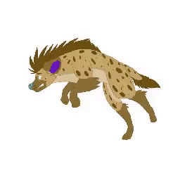
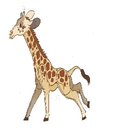

### Comparison Table of Video-to-Sketch Motion Transfer:

|   **Input Video**   |       |     |     |      |         |       |        |      |        |       |
| :-----------------: | ------------------------------------------------------- | ----------------------------------------------------- | ----------------------------------------------------- | ------------------------------------------------------ | --------------------------------------------------------- | ------------------------------------------------------- | ----------------------------------------------------- | ----------------------------------------------------- | ----------------------------------------------------- | ----------------------------------------------------- |
|  **Input Sketch**   |  |  |  |  |  |  |  |  |  |  |
|   **FOMM**   |       |     |     |      |         |       |        |      |        |       |
|   **MoTrans**   |       |     |     |      |         |       |        |      |        |       |
|   **TPS**   |       |     |     |      |         |       |        |      |        |       |

#### Papers:

- [x] [NeurIPS 2019] FOMM: https://aliaksandrsiarohin.github.io/first-order-model-website/

- [ ] [CVPR 2021] MRAA: https://snap-research.github.io/articulated-animation/

- [x] [ECCV 2022] Motion-Trans: https://github.com/JialeTao/MoTrans

- [ ] [CVPR 2022] Structure Aware: https://github.com/JialeTao/DAM

- [x] [CVPR 2022] TPS: https://github.com/yoyo-nb/Thin-Plate-Spline-Motion-Model

- [ ] [ECCV 2022] Cross-domain Motion Transfer: https://arxiv.org/abs/2209.14529 
